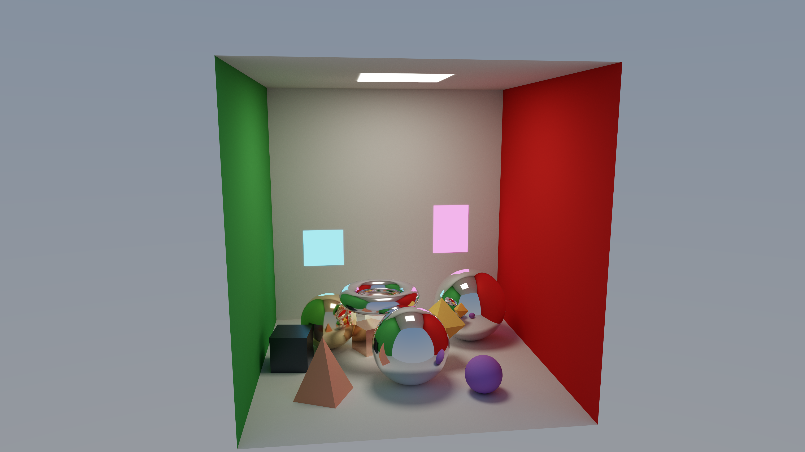
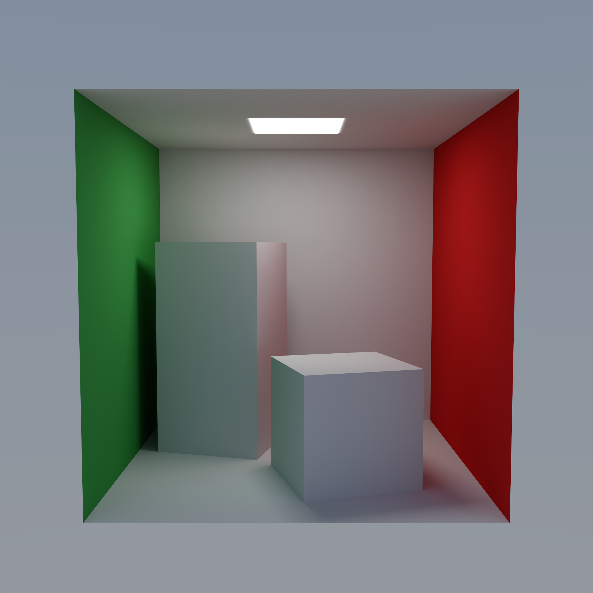
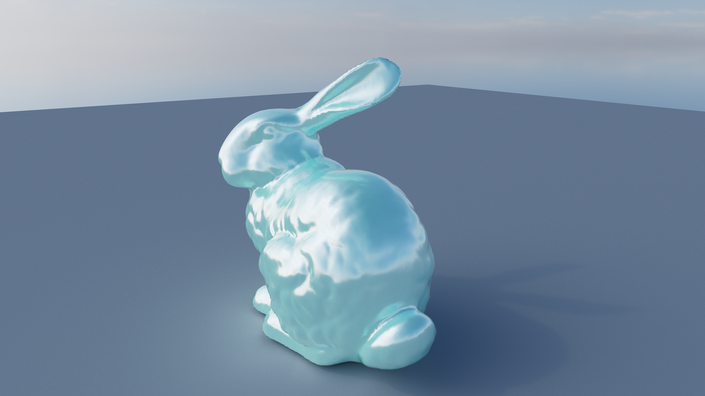
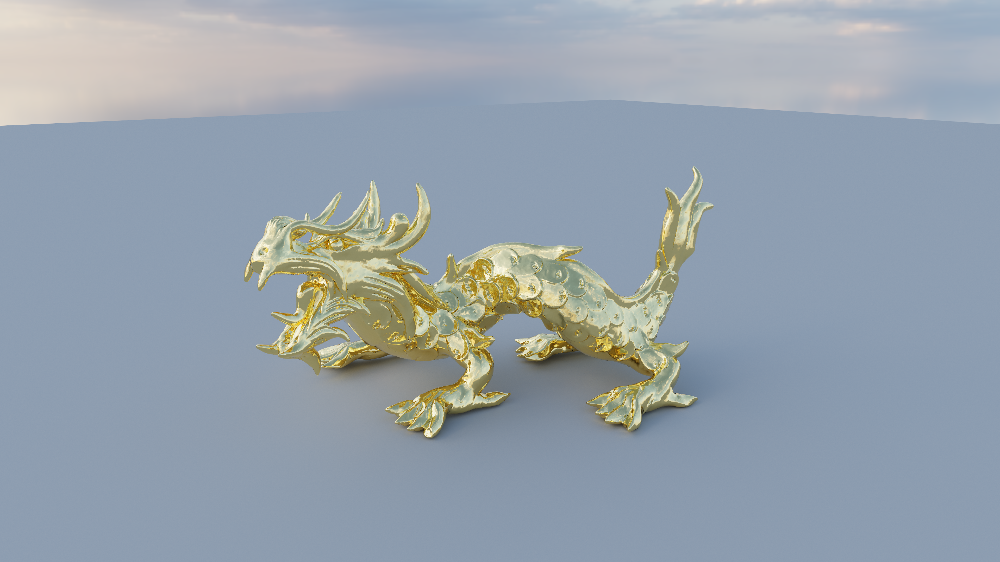
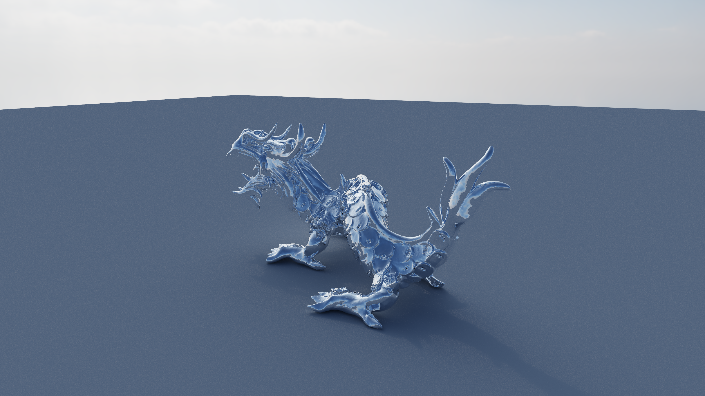
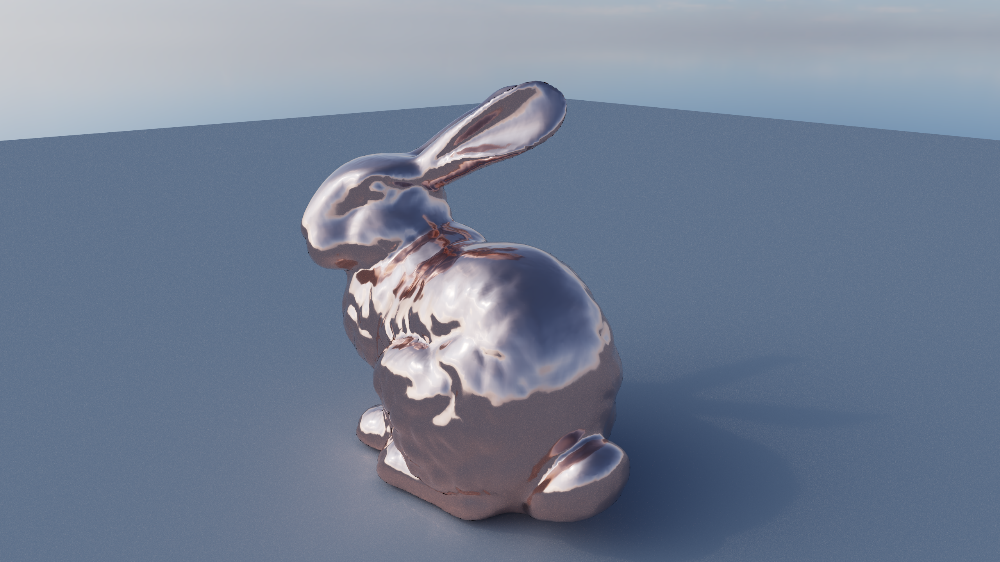

# Wavefront Path Tracer - Demo & Results

A visual + performance showcase of the GPU wavefront path tracer: hero renders, a
live orbit animation, and RTX 4090 benchmarks.

> Hero renders captured on an **NVIDIA GeForce RTX 4090 (Ada, SM 8.9, 24 GB)**,
> CUDA 13.3, at up to 8192 samples/pixel, 8 bounces, ACES tonemapped.

*Live render from the interactive demo scene (CUDA wavefront integrator, ACES tonemapped).*

---

## 1. Hero Renders

*Cornell box - global illumination, color bleeding, and soft area-light shadows.*

*Material gallery - the full BSDF set (Lambert, Oren-Nayar, GGX metal, glass, plastic, thin-film) across a roughness sweep.*

*Mesh lit purely by an `.hdr` environment map (image-based lighting).*

*Gold dragon - 249k-triangle OBJ traversed with the SAH-BVH, per-vertex normals.*

*Chrome dragon - GGX conductor BSDF with sharp specular reflections.*

*Copper bunny - tinted metal with contact shadows on a ground plane.*

### Render cost (RTX 4090, 8192 spp)

Wall-clock time to render each hero still headless on a single RTX 4090.

| Image | Resolution | Triangles | Total time | ms / sample | Samples / s |
|---|---|---|---|---|---|
| `dragon_chrome.png` | 3840×2160 | 249,882 | 103.0 s | 12.57 | 79.5 |
| `mesh_dragon.png` | 3840×2160 | 249,882 | 123.1 s | 15.02 | 66.6 |
| `materials_gallery.png` | 3840×2160 | 10,416 | 136.4 s | 16.65 | 60.1 |
| `hdri_scene.png` | 3840×2160 | 69,451 | 106.7 s | 13.03 | 76.8 |
| `cornell.png` | 2160×2160 | - | 118.0 s | 14.40 | 69.4 |
| `bunny_copper.png` | 2560×1440 | 69,451 | 51.1 s | 6.24 | 160.4 |

ms/sample scales with pixel count (and to a lesser degree triangle count), so the
2560×1440 and 2160×2160 stills converge fastest. All renders use up to 8 bounces.

## 2. Live Orbit (real-time CUDA-OpenGL interop)

<video src="media/video/orbit/animation.mp4" width="640" controls></video>

If the player doesn't load, [watch the orbit animation directly](media/video/orbit/animation.mp4).

*Live orbit captured from the interactive viewer (CUDA-OpenGL interop). 180 frames
at 1920×1080, 256 spp/frame (gold dragon, 249,882 triangles) - 225.8 s total,
**1254 ms/frame** on an RTX 4090, encoded to H.264 at 30 fps.*

## 3. Benchmarks

Throughput of the interactive demo scene (8 bounces) on an RTX 4090, measured straight
from the renderer's own per-sample timing (`scripts/cloud/benchmark.sh`,
[`profiling/benchmarks/benchmarks.csv`](profiling/benchmarks/benchmarks.csv)).

| Resolution | ms / frame | FPS | Mrays/s (primary) |
|---|---|---|---|
| 1280×720 | 4.67 | 214 | 197 |
| 1920×1080 | 10.01 | 99.9 | 207 |
| 2560×1440 | 17.62 | 56.7 | 209 |
| 3840×2160 | 38.71 | 25.8 | 214 |

Primary-ray throughput holds at ~200 Mrays/s across resolutions, confirming the
wavefront pipeline stays GPU-bound rather than launch-bound as pixel count grows.
See [`docs/PERFORMANCE.md`](../PERFORMANCE.md) for the full breakdown and
[`docs/ARCHITECTURE.md`](../ARCHITECTURE.md) for the kernel pipeline these numbers
come from.

## 4. Profiling (Nsight)

The wavefront design keeps each kernel small, so register pressure stays low and
achieved occupancy stays high versus a megakernel; the SoA path-state layout makes
per-path global loads coalesce into single transactions per warp. The two kernels to
profile for these claims are `intersect` (BVH traversal, latency-bound) and
`shade_surface` (BSDF, coalesced SoA loads). Capture commands and tooling live in
[`scripts/capture/README.md`](../../scripts/capture/README.md) and
`scripts/cloud/profile.sh`.

---

## Reproducing these results

All stills, benchmarks, and the orbit video render **headless** over plain SSH -
no display required. See [`docs/CLOUD.md`](../CLOUD.md) for the full GPU-in-the-cloud
workflow.

1. Fetch the CC0 demo assets (gitignored Poly Haven HDRIs + classic test meshes):
   `powershell -File scripts\assets\fetch-demo-assets.ps1`.
2. Build: `powershell -File run.ps1` (needs `CUDA_PATH` set to the CUDA 13.3 dir).
3. Render a hero still: `wavefront-path-tracer --headless --frames 8192 -o out.png`
   (add `--scene <mesh.obj> --hdri <env.hdr> --material <preset> --floor` as needed).
4. Orbit video: `wavefront-path-tracer --animate orbit --anim-frames 180 --spp 256 --video`.
5. Benchmarks: `bash scripts/cloud/benchmark.sh` -> `profiling/benchmarks/benchmarks.csv`.
